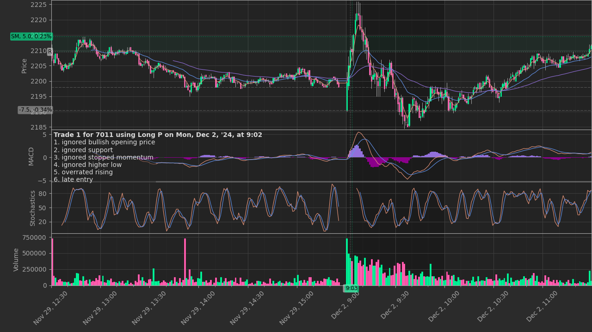
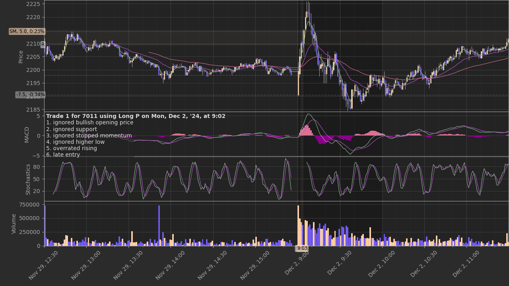
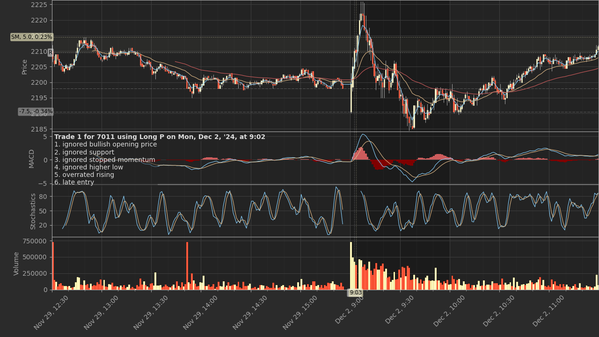

# trading-grapher #

<!-- Python script that visualizes the results of stock day trading in a
spreadsheet using mplfinance based on historical data from Yahoo Finance -->

The `trading_grapher.py` Python script visualizes the results of stock day
trading in a spreadsheet, as well as the MACD and the stochastics, using the
`mplfinance` package based on historical data from [Yahoo
Finance](https://finance.yahoo.com/).

> **Warning**: `trading_grapher.py` is currently under heavy development.
> Changes in functionality may occur at any time.

## Prerequisites ##

`trading_grapher.py` has been tested on Debian Testing on WSL and requires the
following packages:

  * [`mplfinance`](https://github.com/matplotlib/mplfinance) to plot trade data
    and the indicators based on historical data
  * [`odfpy`](https://github.com/eea/odfpy) to read the trading journal
    recorded in an OpenDocument Spreadsheet file
  * [`prompt_toolkit`](https://python-prompt-toolkit.readthedocs.io/en/master/index.html)
    to complete possible values or a previous value in configuring
  * [`yahoo_finance_api2`](https://github.com/pkout/yahoo_finance_api2) to
    retrieve historical data from Yahoo Finance

Install each package as needed. For example:

``` shell
python -m venv .venv
. .venv/bin/activate
python -m pip install -r requirements.txt -U
```

## Usage ##

First, configure the path to your trading journal spreadsheet, the sheet name,
and the directory path for storing historical data and charts:

``` shell
python trading_grapher.py -G
```

Next, configure the columns of the trading journal:

``` shell
python trading_grapher.py -J
```

The `~/.config/trading-grapher/trading_grapher.ini` configuration file stores
the configurations above. Then:

``` shell
python trading_grapher.py [%Y-%m-%d ...]
```

### Options ###

  * `-f FILE`: specify the file path to the trading journal spreadsheet
  * `-d DIRECTORY`: specify the directory path for storing historical data and
    charts
  * `-B [DIRECTORY]`: generate a Bash script for running trading_grapher.py
    with an optional output directory
  * `-G`: configure general options and exit
  * `-J`: configure the columns of the trading journal and exit
  * `-C`: check configuration changes and exit

## Styles ##

`trading_grapher.py` provides the following style modules, which you can
specify using the `-G` option.

### `fluorite` ###



### `ametrine` ###



### `amber` ###



## License ##

[MIT](LICENSE.md)
